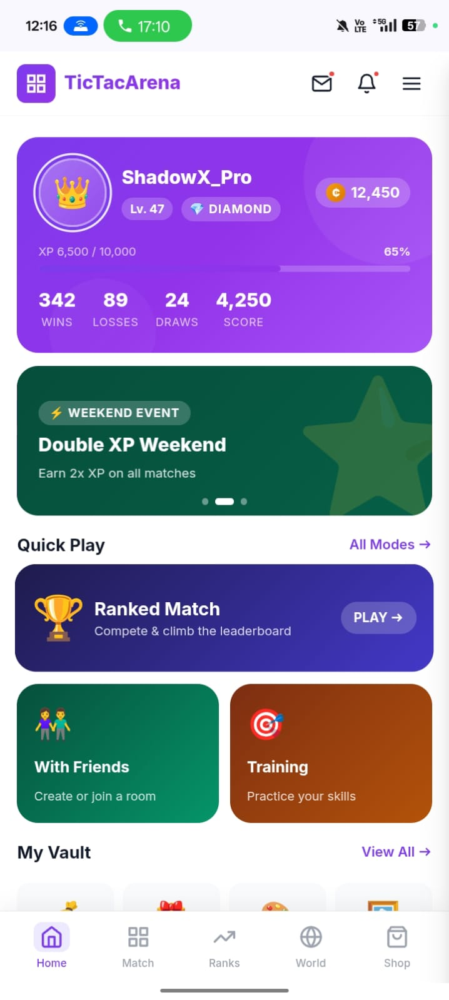
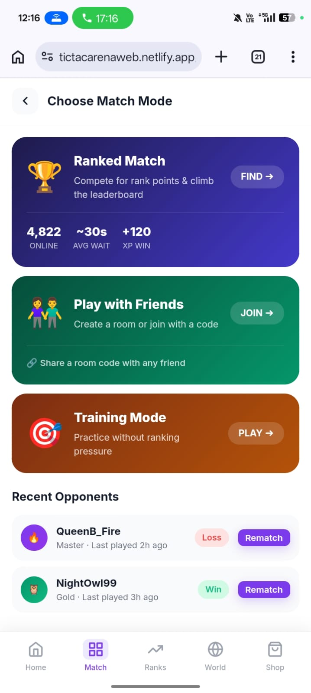
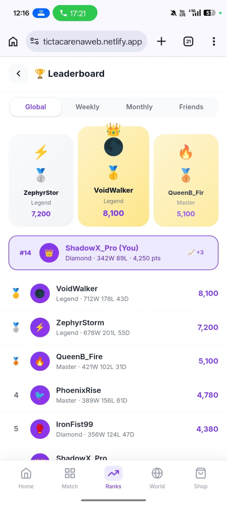
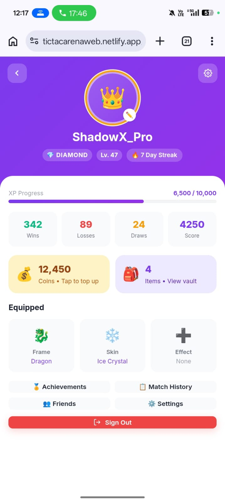
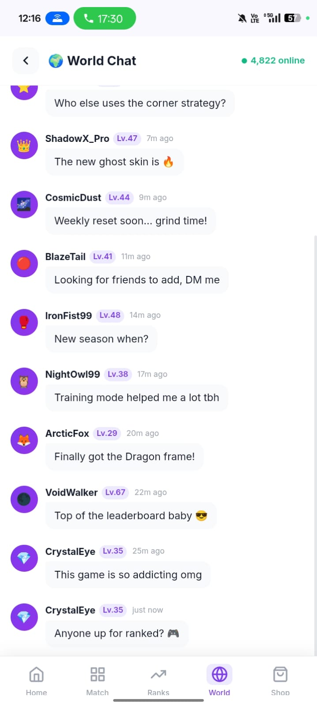
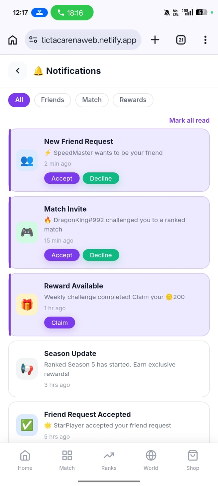
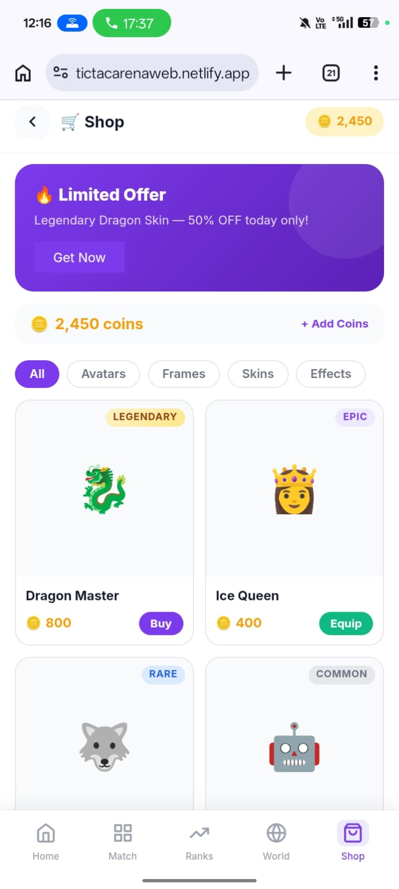
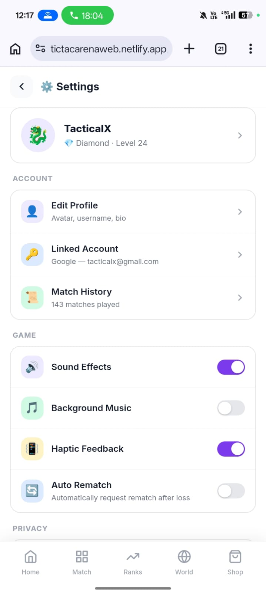
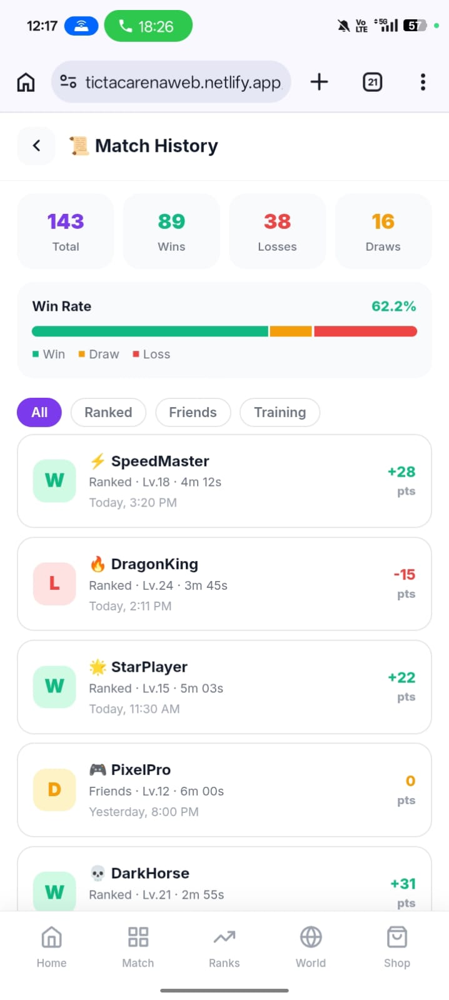
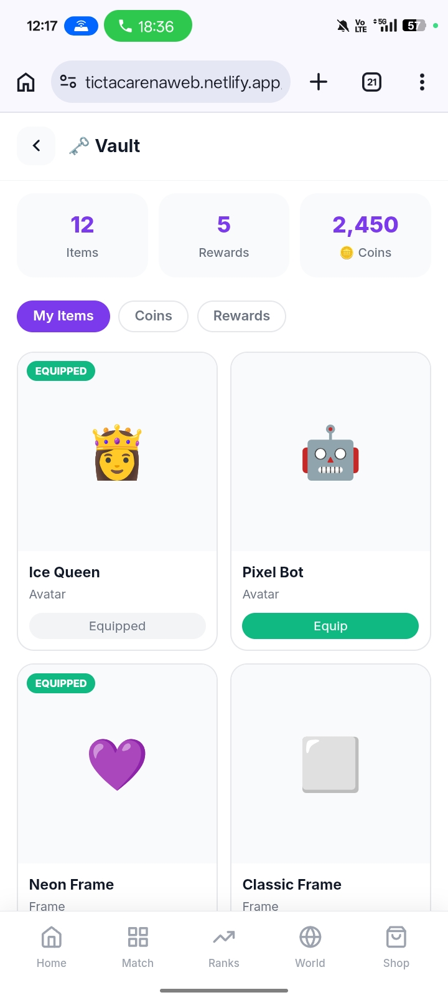

🎮 TicTacArena

TicTacArena is a modern and responsive Tic Tac Toe web application designed with a clean UI and smooth user experience. It showcases advanced gameplay concepts like matchmaking, ranking systems, and real-time interactions in a structured interface.

---

🌐 Live Demo

👉 https://tictacarenaweb.netlify.app

---

⚠️ Disclaimer

This project is a frontend-only implementation.
All features such as multiplayer, matchmaking, chat, ranking, and real-time systems are UI/UX simulations and do not include a production backend.

The goal of this project is to demonstrate design, architecture, and user experience flow of a full-scale application.

---

📸 Screenshots

🏠 Home

🎮 Match

🏆 Leaderboard

👤 Profile

💬 World Chat

🔔 Notifications

🛒 Shop

⚙️ Settings

📜 Match History

📦 Vault

---

🚀 Core Features

🎮 Gameplay

- Real-time multiplayer Tic Tac Toe (UI simulation)
- Turn-based gameplay with timer
- Smooth and interactive game interface
- Rematch system (friend & ranked flow)

---

🎯 Matchmaking System

- Random matchmaking (FIFO concept)
- Ranked matchmaking (skill-based UI flow)
- Match queue and cancel system
- Auto timeout handling (simulated)

---

👥 Play With Friends

- Create private rooms
- Join via room code
- Direct friend matches
- Ready state before match starts

---

🧠 XP & Level System

- Win → +20 XP
- Loss → +10 XP
- Draw → +15 XP
- Level progression system
- XP progress visualization

---

🪙 Coin System

- Win → +10 Coins
- Loss → +5 Coins
- Draw → +7 Coins
- Coins used for in-app purchases

---

🏆 Rank System

- Tier system (Bronze → Master)
- Rank Points (RP) concept
- Promotion & demotion flow
- Rank badge display

---

📊 Leaderboard

- Global leaderboard
- Weekly & monthly ranking system
- Friends leaderboard
- Top players view

---

👤 User Profile

- Unique UID system
- Custom username
- Avatar system
- Display of XP, coins, and rank

---

👥 Friend System

- Add friends via UID
- Accept / reject requests
- Remove or block users

---

💬 Chat System

🌍 World Chat

- Global chat interface
- User info display (avatar, level)
- Anti-spam concept

💌 Personal Chat

- One-to-one messaging UI

🎮 In-Game Chat

- Chat during gameplay

---

📬 Mailbox System

- Admin messages UI
- Rewards and gifts system

---

🔔 Notification System

- Real-time notification UI
- Match alerts
- Chat notifications

---

🛒 Shop & Inventory

- Buy avatars, frames, boards
- Inventory management system
- Equip / unequip functionality

---

📜 Match History

- Previous match records
- Opponent details
- XP and coin summary

---

🛠 Tech Stack

- HTML
- CSS
- JavaScript

---

⚙️ Run Locally

git clone https://github.com/rajsingh93/tictacarena.git
cd tictacarena

Open "index.html" in your browser.

---

📁 Project Structure

index.html
style.css
script.js
docs/
README.md

---

🚀 Future Improvements

- Backend integration (Node.js / WebSockets)
- Real-time multiplayer system
- Database integration
- AI opponent
- Tournament system

---

🤝 Contributing

Contributions are welcome!
Feel free to fork this repository and submit a pull request.

---

📄 License

This project is licensed under the MIT License.
